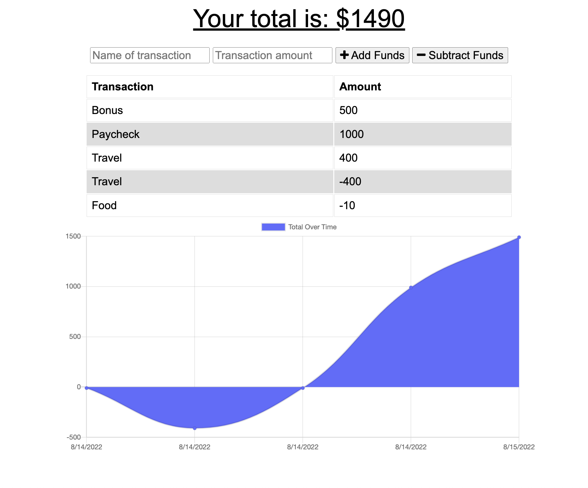

# Budget Tracker

## Contents

  - [User Story](#user_story)
  - [Acceptance Criteria](#acceptance_criteria)
  - [Installation](#installation)
  - [Usage](#usage)
  - [Contributing](#contributing)
  - [Tests](#tests)
  - [License](#license)
  - [Attributions](#attributions)
  - [Questions](#questions)

## User Story

```md
AS AN avid traveler
I WANT to be able to track my withdrawals and deposits with or without a data/internet connection
SO THAT my account balance is accurate when I am traveling 
```

## Acceptance Criteria

```md
GIVEN a Budget Tracker without an internet connection
WHEN the user inputs an expense or deposit
THEN they will receive a notification that they have added an expense or deposit
WHEN the user reestablishes an internet connection
THEN the deposits or expenses added while they were offline are added to their transaction history and their totals are updated
```

## Installation

Run the following command in your terminal in order to install all the packages:

`npm install`

Start the node application by running: 

`npm start`

## Usage



Link to [deployed application](https://rocky-bayou-14082.herokuapp.com/)

## Contributing

In order to contribute, create a pull request and follow the steps listed below:

- Fork the repo
- Create a feature branch (git checkout -b NAME-HERE)
- Commit your new feature (git commit -m 'Add some feature')
- Push your branch (git push)
- Create a new Pull Request

Following a code review, your feature will be merged.

## Tests

No testing protocols were implemented in this application

## License

[](https://opensource.org/licenses/MIT)

This application is licensed under the MIT License.

## Attributions

* The code for this project was provided by my instructor, [Gary Almes](https://github.com/garytalmes/pwa_adventuretime)
* Deployed through [Heroku](https://www.heroku.com/) using [Mongo Atlas](https://www.mongodb.com/atlas/database)

## Questions

If you have any questions, please contact me at my [email](mailto:leandrikuyk@gmail.com?subject=%20Budget%20Tracker). You can find more of my work on my GitHub at [LeandriB](https://github.com/LeandriB). 